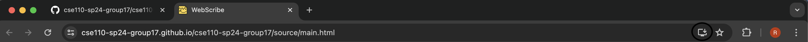
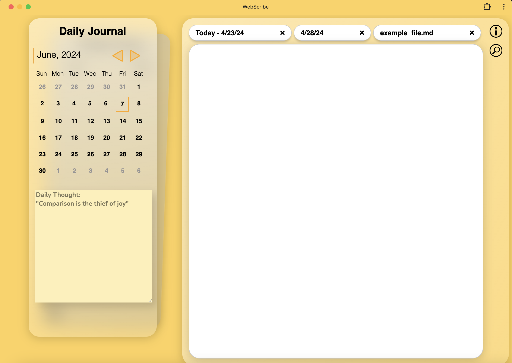
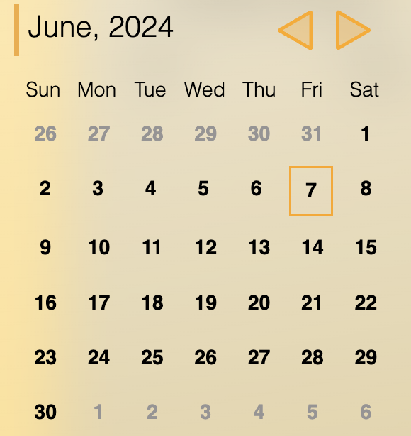
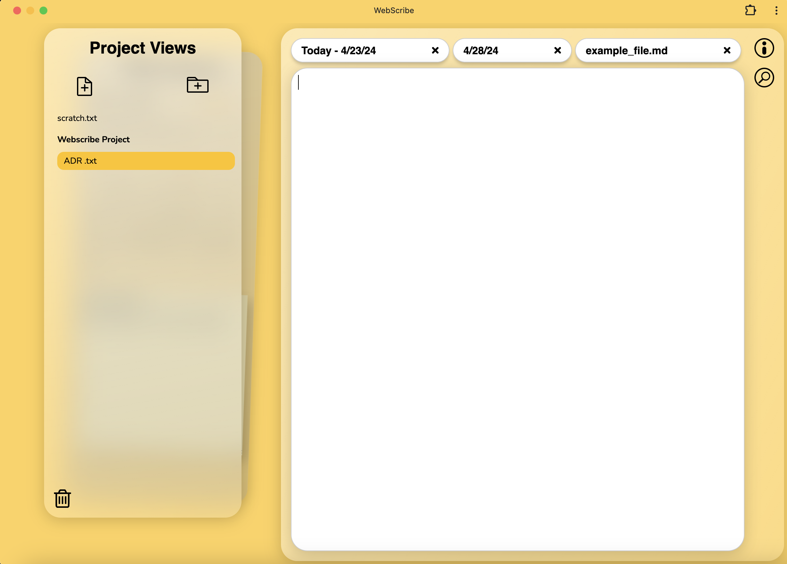
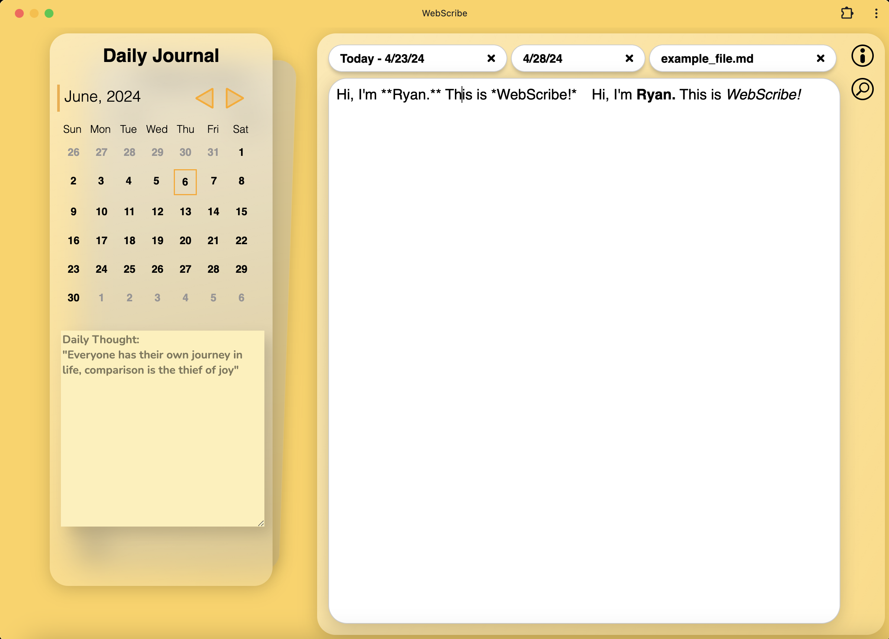

# User Guide: Web App Overview

Welcome to **WebScribe!** Our application provides a comprehensive platform for managing journals, editing markdown files, exploring files, and more. This guide will walk you through the various features and components of our app.

# Progressive Web App Download Instructions

To download our web app, simply travel to our [Webscribe url](https://cse110-sp24-group17.github.io/cse110-sp24-group17/source/main.html) and click the download button to the right of the url.

## 1. Journal View

The Journal View component allows you to view journal entries for specific dates. You can navigate between dates, open a calendar to select a date, and switch between different journal entries effortlessly.

**Key Features:**

- Navigate between dates using the previous and next buttons.
- Open the calendar tab to select a specific date.
- View and edit journal entries for the selected date.

## 2. Calendar Component

The Calendar Component displays dates of the month and enables easy navigation and selection of specific dates.

**Key Features:**

- Display the dates of the month.
- Select a specific date to view associated journal entries.

## 3. File Explorer Component

The File Explorer Component provides an intuitive interface for navigating through files and directories within the file system.

**Key Features:**

- View markdown files and directories.
- Create, delete, and manage files and directories.
- Drag and drop files to nest them within directories of your choice!
- Enter "delete mode" to delete files with a single click, or drag and drop into trash.

## 4. Markdown Editor Component

The Markdown Editor Component allows you to edit markdown files with ease. It provides syntax highlighting and supports unwrapping markdown blocks into plain text view. A cool feature of our markdown editor is that you can drag and drop pictures from our download folder and display it in your journal.

**Key Features:**

- Edit markdown files with syntax highlighting.
- Unwrap markdown blocks into plain text view for easier editing.

## Core Model (Developement Info)

Our app follows a "model and view" architecture to separate business logic from user interface components. Here's a brief overview of the core model classes:

- **App:** Represents the web app and provides access to the Journal Store and File Store instances.
- **File Store:** Manages the virtual file system, allowing for file creation, deletion, searching, and syncing.
- **Journal Store:** Manages journal entries using the File Store, enabling creation and retrieval of journal entries for specific dates.
- **MDFile:** Represents parsed markdown files, consisting of an array of blocks with syntax tree nodes.
- **MDFileParser:** Parses text buffer into MDFile instances.
- **MDASTNode:** Abstract syntax tree of markdown language, with each node containing its range on the text buffer.

## Getting Started

To begin using our app, simply navigate to the desired component using the provided "swiping" interface. You can view journal entries, edit markdown files, explore files, and more with ease. Enjoy exploring and organizing your content efficiently with our intuitive web app!

If you have any questions or need assistance, feel free to reach out to our support team. Thank you for choosing our Web App for your journaling and file management needs!
