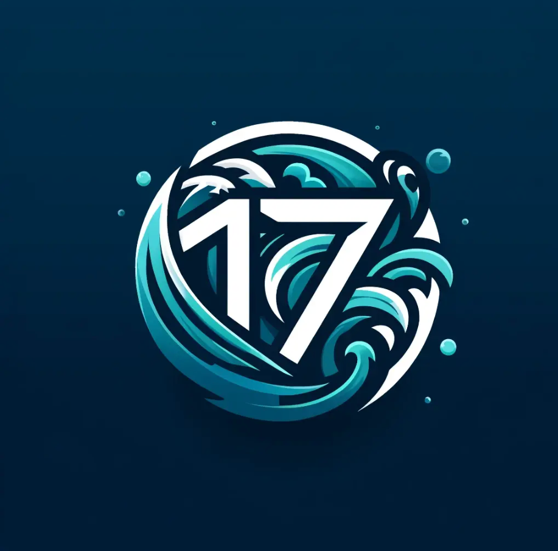

# Surfside Software

## Team Values

- Communication
- Teamwork
- Patience
- Respect
- Trust

## Our Team

### Jacob

My name is Jacob Roner. I am a computer science major at UCSD. I grew up not too far from UCSD in a city called Escondido.

https://jroner.github.io/110PagesProject/

### Melissa

Nice to meet you! I am currently a fourth year at UCSD and I am studying Bioengineering with a concentration in Bioinformatics.

https://mosherof.github.io/UserPageCSE110/

### Pedro

- From Mexico, born in Mexico City
- Played basketball in high school
- Love to play video games and read books
- I love to cook for myself and others
- Watching Veratasium, Numberphile and LaLigaDeLosSuperCuates ocupy my free afternoons

https://peds24.github.io/AboutMe/

### Peter

My name is Peter Chang a current third year student at UCSD.

https://p7chang.github.io/CSE110-Lab1/

### Ruiping

I am a junior year student, and I am interested in database and machine learning.

I am work with Prof. Ousterhout’s research team on Analyzing the Usability of Systems for Querying “Eclectic” Data

https://ruiping-fang.github.io/cse110/

### Ryan I.

My name is Ryan Izadshenas and I am a second-year undergraduate student studying Computer Science w/Bioinformatics at UCSD.

https://ryan-izad.github.io/LabWeek1/

### Ryan L.

Hello! I'm Ryan, a second year Computer Science major here at UC San Diego in Revelle College. A few things I enjoy spending my free time doing:

1. **Hanging out with friends**
   - Here's a [goofy picture](https://ryanliulwy.github.io/CSE110-Lab1/images/hatstack.png) they took of me and a mighty stack of hats a while back
2. **Playing video games**
   - Recently I've been getting into a game called _The Finals_
   - I've also been playing a lot of modded _Terraria_ these days
   - Unfortunately, my friends also drag me into their _League of Legends_ matches
3. **Practicing the piano**
   - I used to take part in piano competitions before ([here's a recording](https://www.youtube.com/watch?v=ncm4KW2-Qyw) of one of the hardest pieces I learned!)
   - Now I mostly do it for fun and play music from shows and games I like :)

https://ryanliulwy.github.io/CSE110-Lab1/

### Sean

My name is Sean. I am a programmer who likes to code in java. I also like to learn new things about code. As a person, I like to eat at different food places with my friends and play basketball.

https://sgtran1.github.io/CSE110/

### Sihan

Hello, I’m Sihan Wang! I’m a junior major in Math-cs from Marshall College in UC San Diego.

https://33sihan.github.io/CSE110/

### Sunho

My name is Sunho. I’m a third year cs student from Muir College.

I’ve been really passionate about programming since when I was in elementary school. So, if you want to have a nerdy technical discussion or are stuck on some weird bug, feel free to hit me up! If you’re curious about the works I’ve done, you can find them in: [suhno.io](https://sunho.io)

Besides work, I love playing chess and tetris. I’ve also started cooking most of my meal since last year and it has become a sort of hobby. The best food I can make is spicy stir-fried fork. I try to jog every single day, so you might find me running across campus at random hours.

https://sunho.io/cse110/
